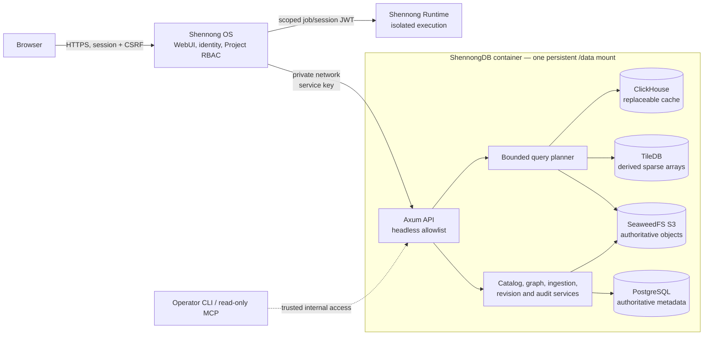
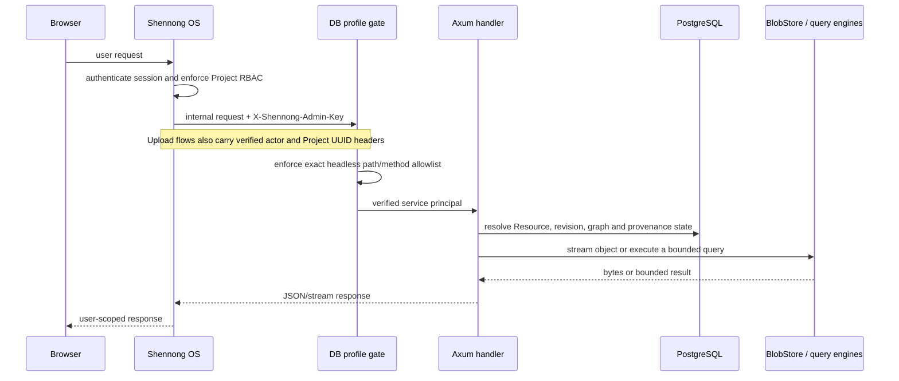

# ShennongDB

ShennongDB 1.0.0 is the headless biomedical data plane for the Shennong V1
platform. It owns Resource metadata, immutable revisions, Artifacts, Relations,
Research Graph records, ingestion, object storage, bounded queries, and
provenance. It does not own browser sessions, registration, Project membership,
Chat, Memory, model providers, or Agent Skills; those are Shennong OS
responsibilities.

The production image exposes only an internal Rust/Axum API. The former WebUI
and Pi runtime source trees remain in this checkout as rollback and migration
references, but are not copied into or started by the V1 image.

## Architecture at a glance



The solid arrows are production request paths. ShennongDB neither authenticates
end users nor executes arbitrary analysis code: OS authorizes each operation,
DB owns governed biomedical data, and Runtime owns isolated computation.

### Authenticated request and data flow



See [the current architecture and design contract](docs/architecture.md) for
state ownership, API boundaries, data lifecycle, failure recovery, and the
contracts with Shennong OS and Shennong Runtime.

## Trust boundary

`SHENNONG_DB_PROFILE=headless` is the default. In this profile:

- every `/api/v1/*` and `/.well-known/*` request requires the deployment-only
  `X-Shennong-Admin-Key` service credential;
- only the explicit data-plane path and method allowlist is reachable;
- authentication, users, Chat, Memory, AI providers, Agent context, grants,
  collections, favorites, and legacy `/api/v1/projects` routes return 404;
- the Research Graph API is namespaced as `/api/v1/research-projects/*` to
  avoid confusing a DB graph record with the OS authorization boundary;
- `PUT /api/v1/research-projects/{id}` is the only Project-shadow mutation:
  OS uses it to idempotently mirror the authoritative Project record, while
  `owner_user_id` remains an opaque OS identifier and DB creates no local user
  or `project_members` row;
- production refuses missing or shorter-than-32-byte service credentials;
- production refuses the compatibility `legacy` profile unless the operator
  explicitly enables it.

Shennong OS authenticates the user, enforces Project RBAC, and then calls this
service over a private control network. ShennongDB never accepts browser
cookies as the authorization boundary in headless mode.

## Data services

The current image keeps the established single-volume data topology:

- PostgreSQL: catalog, immutable revisions, graph, ingestion, and audit data;
- SeaweedFS S3: uploads and Artifacts;
- ClickHouse: replaceable analytical query cache;
- embedded TileDB worker: sparse expression arrays;
- Rust binaries: API server, operator CLI, and read-only MCP adapter.

Only port `8000` is used by the API. PostgreSQL, S3, ClickHouse, and TileDB stay
on loopback inside the container. `/data` is the only persistent mount.

## V1 API

Health endpoints do not require the service credential:

- `GET /health`, `GET /healthz`, `GET /version`, `GET /metrics`

Representative authenticated data-plane endpoints:

- `GET /api/v1/resources`
- `GET|PUT /api/v1/resources/{id}`
- `GET|POST /api/v1/resources/{id}/artifacts`
- `GET /api/v1/resources/{id}/artifacts/{artifact_id}/download`
- `GET|POST /api/v1/resources/{id}/relations`
- `GET /api/v1/resources/{id}/graph-context`
- `GET|POST /api/v1/resources/{id}/revisions`
- `GET /api/v1/resources/{id}/revisions/{revision}`
- `GET /api/v1/research-projects/*` for data graph/context records
- `PUT /api/v1/research-projects/{id}` for the service-only OS Project-shadow
  synchronization contract
- `/api/v1/graph/*` for bounded graph discovery
- `POST /api/v1/query`, `/query/batch`, and `/query/stream`
- `/api/v1/uploads*`, `/api/v1/backups*`, `/api/v1/storage`, and provider
  installation endpoints used by authorized OS workflows.

In the headless profile, upload/list/register requests additionally require
`X-Shennong-OS-Actor-ID` and `X-Shennong-OS-Project-ID` UUID headers alongside
the service-admin key. DB accepts these opaque identities only from that
verified service principal, requires exact actor/Project ownership at
registration, and atomically binds the resulting private Resource to the same
Project. Legacy-profile users continue to use the existing DB-local user
foreign key.

Resource revisions are append-only. Revision 1 cannot have a parent; every
later revision must reference the immediately preceding revision, and the
database rejects update or delete mutations.

## Standalone development

```bash
cp .env.example .env
docker compose up -d
curl http://127.0.0.1:18080/health
```

The normal V1 deployment is the unified Shennong stack under
`/srv/shennong.one`; see the
[Shennong OS V1 deployment guide](https://github.com/zerostwo/shennong-os/blob/v1.0.0/deploy/README.md).
This standalone Compose file binds to loopback for service development only.

## Verification

```bash
cargo fmt --all --check
cargo clippy --workspace --all-targets -- -D warnings
cargo test --workspace
./scripts/test-headless-platform.sh

# Optional compatibility coverage for the retired standalone application API.
SHENNONG_TEST_DB_PROFILE=legacy \
SHENNONG_TEST_ALLOW_LEGACY_PROFILE=1 \
./scripts/test-platform.sh
```

The compatibility source can be removed in a later cleanup release after the
Shennong OS migration has been deployed and rollback-tested. It is deliberately
kept out of the V1 production image now so migration and cleanup remain separate,
recoverable changes.

## License

ShennongDB is licensed under the [MIT License](LICENSE).
