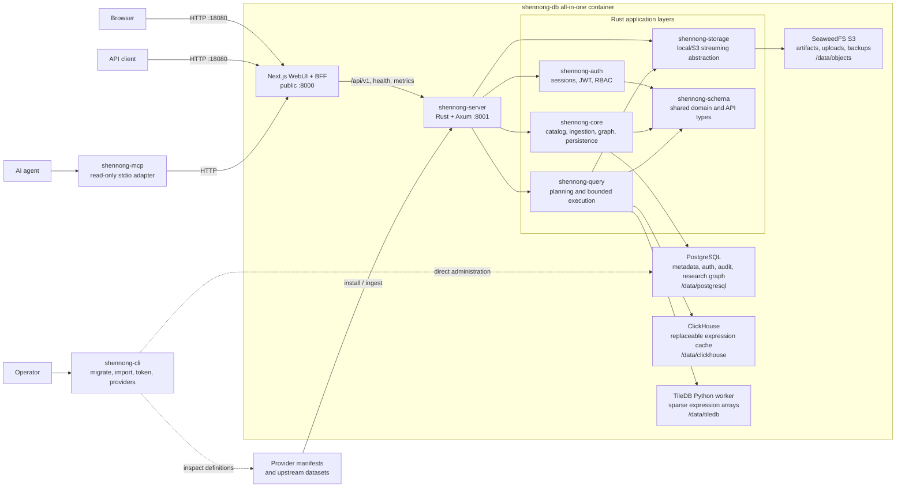

# ShennongDB

ShennongDB is a biological data infrastructure service. It exposes Resources,
Artifacts, Relations, Projects, and Research Graphs through a metadata-first
API. One image contains the Next.js WebUI and gateway, the Rust API, PostgreSQL
metadata, SeaweedFS object storage, an internal ClickHouse query cache, and
embedded TileDB arrays.

## Architecture

ShennongDB has one public HTTP boundary and one persistent volume. The services
inside the all-in-one image communicate over loopback and are not exposed
directly.



The main request and data paths are:

1. Docker maps host port `18080` to the Next.js gateway on container port
   `8000`. Browser API calls pass through the bounded `/api/v1` BFF to the
   internal Rust service on `8001`; health, metrics, version, and agent
   discovery routes are rewritten to the same service.
2. `shennong-server` composes authentication, the Resource catalog, Projects,
   Research Graph, ingestion, administration, and query APIs. PostgreSQL is the
   source of truth for metadata, permissions, sessions, audit events, jobs, and
   graph records.
3. Artifacts, uploads, and metadata backups use the `shennong-storage`
   abstraction and are stored through SeaweedFS's S3-compatible API. Provider
   installation records immutable metadata in PostgreSQL and publishes data to
   object storage.
4. `shennong-query` validates each operation and routes it to object-backed
   adapters or TileDB. Eligible expression results are read from and filled
   into ClickHouse; ClickHouse is a bounded, replaceable cache rather than the
   authoritative data store.
5. `shennong-mcp` is a separate read-only stdio-to-HTTP adapter for agents.
   `shennong-cli` is a separate operator entry point for migrations, atomic
   imports, token creation, and provider inspection.

The source tree follows the same boundaries: `web/` owns the Next.js UI and
BFF; `crates/shennong-server` owns HTTP composition; `crates/shennong-core`,
`shennong-auth`, `shennong-query`, `shennong-storage`, and `shennong-schema`
hold reusable domain layers; `crates/shennong-mcp` and `crates/shennong-cli`
are separate entry points; and `docker/`, `providers/`, and `seed/` contain
runtime wiring and versioned input definitions.

## Deploy

The production deployment is one Docker Hub image, one Compose service, and one
persistent data mount. PostgreSQL and ClickHouse run inside the container and
are not exposed. TileDB is an embedded library and does not run a separate
server.

```bash
cp .env.example .env
# Set SHENNONG_ADMIN_API_KEY and SHENNONG_JWT_SECRET.
docker compose pull
docker compose up -d
```

The WebUI and API are available on `http://HOST:18080` with the checked-in
`.env.example`. Use `/health` for process health,
`/healthz` for database readiness, and `/version` for release metadata.

## API overview

- `GET /api/v1/resources`, `GET|PUT /api/v1/resources/{id}`
- `GET|POST /api/v1/resources/{id}/artifacts`
- `GET /api/v1/resources/{id}/artifacts/{artifact_id}/download`
- `GET|POST /api/v1/resources/{id}/relations`
- `PUT /api/v1/resources/{id}/grants/{user_id}`
- `GET /api/v1/users`, `GET|PUT /api/v1/users/{id}`
- `POST /api/v1/users/{id}/tokens`
- `GET /api/v1/audit-events`, `GET /api/v1/capabilities`, `GET /api/v1/providers`
- `/api/v1/projects/*` and `/api/v1/graph/*` for Research Graph workspaces
- `/api/v1/collections`, `/api/v1/favorites`, and `/api/v1/uploads*`
- `/api/v1/auth/*` for sessions, personal tokens, profile, password, and 2FA
- `/api/v1/settings`, `/api/v1/backups`, `/api/v1/usage`, and `/api/v1/storage`
- `GET /.well-known/shennong-agent.json` for machine-readable agent discovery
- `GET /api/v1/genes/resolve` for release-aware cross-Resource gene resolution
- `POST /api/v1/resources/install`, `POST /api/v1/query`

Administrator requests use `X-Shennong-Admin-Key` or an active administrator
user's JWT. Administrators can create, update, disable, and issue tokens for
users. Private Resources require an active administrator or an active user with
an explicit grant. Disabling a user invalidates their access immediately.

## Agent discovery

An agent first reads `/.well-known/shennong-agent.json`, which contains only the
Resource inventory and selection metadata. It then follows the selected
Resource's `details_url` to retrieve dimensions, fields, identifiers, analysis
readiness, missing annotation requirements, Artifacts, Relations, and a bounded
query example. Catalog metadata is marked as untrusted descriptive data.

PBMC 10x HDF5 inputs are materialized as sparse TileDB arrays on first startup.
Toil expression queries read only the indexed source row and can join installed
phenotype and survival metadata. ClickHouse remains available for analytical
caches and tabular workloads.

See [docs/guide.md](docs/guide.md) for the complete user guide: installation,
first-run setup, WebUI, API, data access, uploads, Projects, administration, and
troubleshooting. See [docs/performance.md](docs/performance.md) for measured query latency
and the current analysis-readiness boundaries. See
[docs/benchmark-results.md](docs/benchmark-results.md) for reproducible API,
data-access, and WebUI concurrency results. See
[docs/agent-integrations.md](docs/agent-integrations.md) for installing,
configuring, and using the read-only MCP server and the repository Skill at
`.agents/skills/shennong-db`. See
[docs/gene-identifiers.md](docs/gene-identifiers.md) for GENCODE-aware
cross-dataset gene coordination. Run the isolated production regression baseline
with `./scripts/test-platform.sh`; details are in
[docs/production-hardening.md](docs/production-hardening.md).

## Repository navigation

- [Documentation index](docs/README.md) separates current operational guides,
  design references, visual evidence, and archived implementation briefs.
- [CodeGraph map](CODEGRAPH.md) records the source boundaries and the small set
  of graph queries used to navigate dependencies without rescanning the repo.
- [WebUI guide](web/README.md) covers the active Next.js App Router application.
