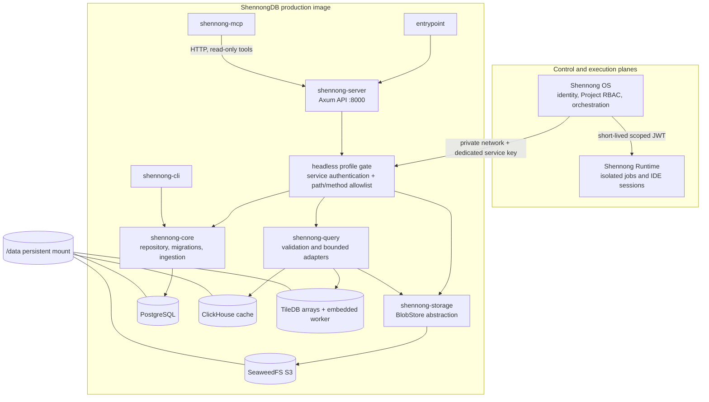
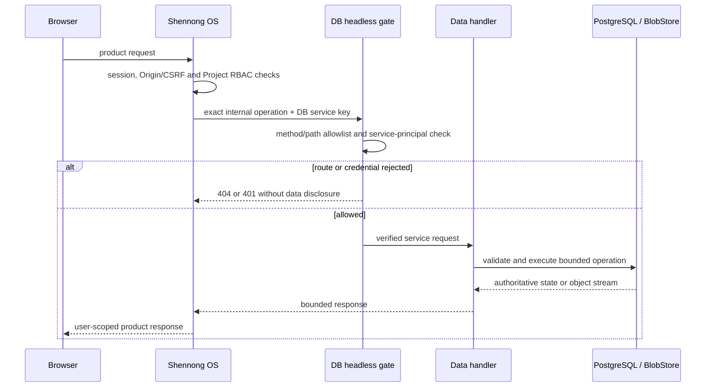
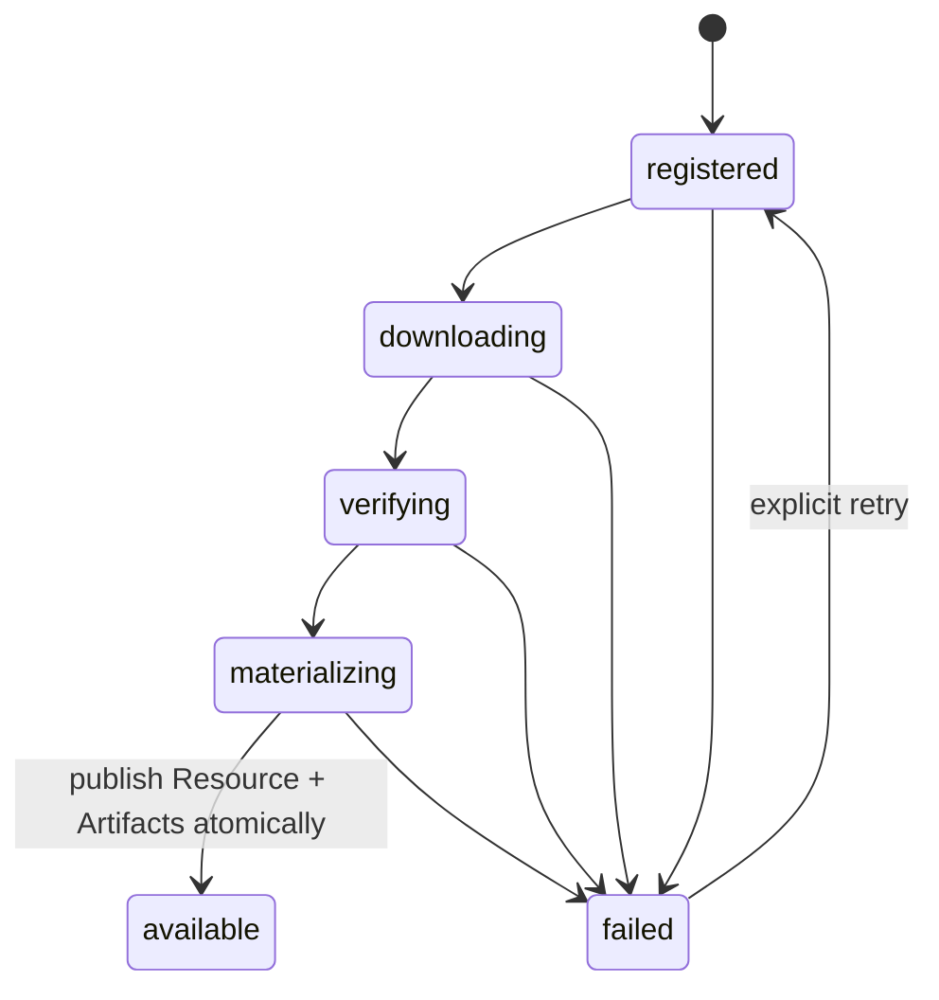
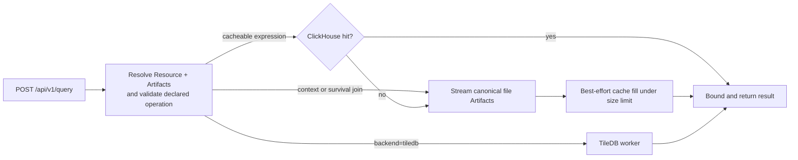

# ShennongDB V1 architecture and design contract

This document describes the current `1.0.0` headless data plane. The checked-in
Rust code, SQL migrations, effective headless allowlist, container entrypoint,
and OpenAPI document remain the executable sources of truth. Historical WebUI
and standalone-agent documents are explicitly not part of this design.

## Purpose and boundary

ShennongDB is the governed biomedical data kernel in Shennong V1. It owns:

- Resource metadata, immutable Resource revisions, Artifacts, Relations, and
  provenance;
- Research Graph records, evidence, studies, activities, and Resource bindings;
- provider ingestion, upload registration, object storage, bounded query
  execution, cache management, and DB-side audit events;
- data-plane health, readiness, metrics, an operator CLI, and a read-only MCP
  adapter.

It does not own the WebUI, end-user identity, registration, session cookies,
Project membership or RBAC, Chat, Memory, model providers, Agent Skills, job
scheduling, IDE sessions, or arbitrary code execution. Shennong OS owns the
control plane and authorization policy. Shennong Runtime is the only component
that executes isolated analysis jobs and IDE workloads.

## Component model

The entrypoint starts the internal PostgreSQL, SeaweedFS, and ClickHouse
processes on loopback, prepares the TileDB and staging directories, and then
starts the Rust API. Only port `8000` is exposed by the image. The default
Compose file maps that port to host loopback for diagnostics; the unified
production stack publishes no DB host port.

### Rust workspace map

| Area | Responsibility |
| --- | --- |
| `crates/shennong-server` | Axum routes, headless gate, service authentication, request limits, uploads, queries, and HTTP error mapping |
| `crates/shennong-core` | PostgreSQL repository, SQL migrations, provider ingestion state machine, graph and provenance persistence |
| `crates/shennong-schema` | Shared Resource, Artifact, Relation, query, graph, and API types |
| `crates/shennong-storage` | Local and S3-compatible streaming BlobStore implementations, ranges, multipart writes, checksums, and presigning |
| `crates/shennong-query` | Resource-declared operation validation, file-backed expression queries, TileDB execution, result bounds |
| `crates/shennong-auth` | Service-key and retained compatibility authentication primitives |
| `crates/shennong-cli` | Trusted operator entry point over the repository and provider services |
| `crates/shennong-mcp` | Read-only, row- and response-bounded agent adapter over the HTTP API |

`webui/`, `web-archive/`, and `agent-runtime/` are migration or rollback
references. They are not copied by the production Dockerfile and must not be
treated as current runtime components.

## State ownership

| State | Authoritative owner | Durability and rule |
| --- | --- | --- |
| Resource, revision, Artifact, Relation, Research Graph, ingestion and audit metadata | ShennongDB PostgreSQL | Durable; migrated at startup; revision and provenance invariants are enforced in SQL as well as handlers |
| Raw and canonical object bytes | ShennongDB BlobStore, SeaweedFS S3 in the bundled image | Durable and checksum-addressed; raw immutable bytes cannot be replaced with different content |
| Derived TileDB arrays | ShennongDB `/data/tiledb` | Durable for recovery-time purposes, but reproducibly derived from governed source Artifacts |
| ClickHouse expression rows | ShennongDB `/data/clickhouse` | Replaceable acceleration cache; cache failure is a miss and canonical query remains the fallback |
| Upload/provider staging | ShennongDB `/data/work` | Temporary and not catalog-visible until verification and registration succeed |
| Semaphores, rate buckets, cache-fill locks, in-memory text/metadata caches | `shennong-server` process | Ephemeral; reset on restart and never a source of truth |
| Users, sessions, invitations, Project membership/RBAC, Thread, Message, Run, Memory, Skill, model provider | Shennong OS PostgreSQL | Never authoritative in DB headless mode, even though compatibility tables and source remain in the repository |
| Runtime job/session journal and untrusted workspaces | Shennong Runtime | Never stored or executed by ShennongDB |
| DB service key | OS-initialized shared config or an explicit unified deployment secret file | Deployment configuration, not application data; with `SHENNONG_CONFIG_DIR`, DB reads `db-admin-key` after OS creates it; standalone diagnostics may generate a fallback under `/data/.shennong-secrets` |

The single `/data` mount is one failure domain. A complete DB restore point must
cover PostgreSQL, object bytes, TileDB, cache state needed for the chosen RTO,
and the matching image/deployment metadata. OS and Runtime state require their
own coordinated backups.

## Effective API contract

The effective V1 surface is the intersection of the Axum router and
`headless_endpoint_allowed` in `crates/shennong-server/src/main.rs`.
`openapi/shennongdb.json` describes request and response shapes; a route present
in compatibility source is still unreachable if the headless gate excludes it.

Unauthenticated orchestrator endpoints are read-only:

- `GET /health`, `/healthz`, `/version`, and `/metrics`.

Every `/api/v1/*` and `/.well-known/*` request allowed in headless mode requires
the dedicated `X-Shennong-Admin-Key`. The current data-plane families are:

- Resource catalog, immutable revisions, Artifacts, downloads, Relations, and
  Resource graph context;
- Research Project shadows and Research Graph context, records, evidence, and
  Resource bindings under `/api/v1/research-projects/*`;
- bounded graph search/subgraph, gene resolution, Resource discovery, and query
  endpoints;
- provider installation and ingestion status;
- streamed uploads, verified registration, storage status, metadata backups,
  audit events, and replaceable cache administration;
- the agent manifest and bounded read-only MCP-facing discovery endpoints.

Legacy auth, user, grant, collection, favorite, Chat, Memory, model-provider,
Agent Skill, and `/api/v1/projects*` routes return non-disclosing 404 responses
before their handlers run. This is deliberate defense in depth while
compatibility code remains in the checkout.

### Request authorization flow

The DB service key proves the caller is Shennong OS; it is not a user identity.
OS must complete user and Project authorization before making the service call.
For upload/list/register flows, OS also sends verified
`X-Shennong-OS-Actor-ID` and `X-Shennong-OS-Project-ID` UUIDs. DB accepts them
only with the service principal, requires the synchronized Project shadow and
exact actor ownership, and binds the resulting private Resource atomically.

## Data lifecycle

### Provider ingestion

Provider/version ingestion is serialized with a PostgreSQL advisory lock. A
successful publish requires at least one Artifact and commits the Resource,
Artifact metadata, and terminal job state in one transaction. Downloads and
conversions remain staging data until verification succeeds. Provider manifests
under `providers/` declare versioned upstream inputs and expected output roles.

### Upload and Artifact registration

1. OS authorizes the actor and Project, synchronizes the Project shadow, and
   streams a bounded upload with the service credential and opaque UUID headers.
2. DB validates identity headers, filename/media constraints, size limits, and
   content digest while writing staging data.
3. Registration promotes verified bytes into the configured BlobStore and
   atomically creates the private Resource, immutable Artifact metadata,
   provenance, and exact Research Project binding.
4. Failed or abandoned staging content is not discoverable as a Resource and
   may be removed after the configured timeout.

Resource revisions are an append-only linear chain. Revision 1 has no parent;
revision N must reference N-1. SQL triggers reject update/delete and invalid
parents. Artifact lineage requires valid immutable parents and JSON shapes;
raw immutable Artifact content cannot be silently replaced under the same id.

### Query and materialization path

The planner only accepts operations declared by the Resource, gene features,
declared context fields, and bounded limits. File-backed queries stream through
the BlobStore; TileDB-backed Resources use the embedded bounded worker.
ClickHouse is never authoritative: an unavailable/full cache falls back to the
canonical Artifact, and cache-write failure does not fail the query. Response
size, concurrency, request time, and rate limits are enforced server-side.

## Security and RBAC boundary

- Browser cookies, bearer sessions, and client-asserted roles are not accepted
  as the headless authorization boundary.
- OS is the only owner of Project membership. A DB Research Project is an
  opaque shadow for graph/provenance scoping, not an authorization database.
- Production startup fails if the service key is missing or shorter than 32
  bytes. The legacy profile additionally requires an explicit production opt-in.
- When neither a key value nor explicit key file is configured and
  `SHENNONG_CONFIG_DIR` is set, the entrypoint waits up to 120 seconds for the
  OS-generated non-empty `db-admin-key` file, then fails closed instead of
  starting with a different service identity.
- The DB service stays on a private control network. Standalone Compose binds
  only to `127.0.0.1` and is for diagnostics, not public ingress.
- Upload names, types, sizes, identities, checksums, lineage, JSON shapes, query
  operations, row counts, response bytes, and traversal depth are bounded or
  validated before use.
- Secrets, complete private payloads, cookies, and credentials must not be
  logged. Backend errors are mapped to stable, non-sensitive API errors.
- ShennongDB has no Docker socket, shell tool, Runtime control credential, or
  arbitrary image/host-mount contract. Scientific code belongs in Runtime.

## Contracts with Shennong OS and Runtime

### Shennong OS

OS must authenticate the user, enforce Project RBAC, synchronize the Research
Project shadow, and call only the minimum DB operation with the dedicated
service key. OS stores user-facing Artifact/Run/Job references and DB identifiers
without duplicating large DB objects. A service credential must never be reused
as a browser or user token.

DB returns governed Resource/revision/Artifact identifiers, checksums, schema,
provenance, graph/evidence records, streams, and bounded query results. It never
returns or infers OS membership. If DB is temporarily unavailable when OS
creates a Project, OS retries the idempotent shadow synchronization before the
next Project-scoped data operation.

### Shennong Runtime

There is no direct DB-to-Runtime control channel in V1. OS submits a validated,
scoped job to Runtime and records the relationship among Project, Run, Job,
input DB Resource revision/Artifact digest, and output Artifact. Runtime owns
execution isolation, job/session state, logs, cancellation, timeouts, and IDE
access. DB owns governed biomedical data and provenance. Any future direct data
transfer contract requires an explicit threat-model and versioned API change;
it must not be improvised through shared secrets or mounts.

## Deployment and operations

The production Dockerfile builds only `shennong-server`, `shennong-cli`, and
`shennong-mcp`, plus the internal data engines. The unified Shennong deployment
must set `SHENNONG_DB_PROFILE=headless`; either mount the DB service-key file
read-only or set `SHENNONG_CONFIG_DIR` to the shared config mount initialized by
OS; attach only to the private control network; mount one DB data directory at
`/data`; enable `no-new-privileges`; and publish no host port. An explicit
`SHENNONG_ADMIN_API_KEY` or `SHENNONG_ADMIN_API_KEY_FILE` takes precedence over
the shared-config bootstrap and both explicit forms must not be set together.

Startup order inside the container is managed by `docker/entrypoint.sh`. The
Rust server applies PostgreSQL migrations before binding the API. Readiness is
the deployment gate; health alone does not prove that metadata, objects, or a
representative query can be served.

### Failure and recovery behavior

| Failure | Expected behavior | Recovery |
| --- | --- | --- |
| Missing shared-config service key | Entrypoint waits up to 120 seconds, then exits; a short key is rejected by the server | Ensure OS initializes the protected `db-admin-key` before the timeout or restore the explicit key file; never print it in automation logs |
| PostgreSQL unavailable or migration fails | API cannot become ready/start successfully | Restore the matching data snapshot or correct the migration fault before serving traffic |
| SeaweedFS/S3 unavailable | Object upload/download and file-backed queries fail without leaking backend details | Recover object storage and verify retained object checksums against PostgreSQL metadata |
| ClickHouse unavailable/full/corrupt | Cache miss; canonical query path remains authoritative | Clear/rebuild cache and monitor RTO impact |
| TileDB worker/array failure | TileDB-backed operations fail; unrelated catalog operations remain independent | Restore or reproducibly rematerialize the derived array from governed inputs |
| Missing local Artifact on startup | Affected local Resource is reconciled to `unavailable` | Restore and verify the Artifact, then republish/reconcile through governed tooling |
| Interrupted provider ingestion/upload | Durable job may become failed; staging remains non-catalog data | Inspect audit/job state, remove expired staging, and retry idempotently |
| Bad image rollout | Image rollback alone may not reverse migrations | Restore the matching pre-upgrade `/data` snapshot and previous image digest |

Follow [backup and recovery](backup-recovery.md) and
[production topology](production-compose.md). A backup is valid only after an
isolated restore verifies service authentication, Project shadows, representative
Resources/revisions/Artifacts, checksums, and warm/cold queries.

## Non-goals and deferred changes

- no public/browser-facing DB API or standalone product UI;
- no user directory, Project membership engine, Chat, Memory, model-provider,
  Agent Skill, or Agent orchestration service;
- no arbitrary code, notebook, container, job, or IDE execution;
- no independent horizontal scaling or failure isolation for the bundled
  PostgreSQL/SeaweedFS/ClickHouse processes in the single-image V1 topology;
- no guarantee that derived/cache data can meet recovery targets without being
  included in backups and drills;
- no clinical diagnosis, regulated-data, HIPAA, or medical-device claim.

Changes that cross these boundaries require a design update, an API/security
review, migration and rollback notes, tests for the effective headless surface,
and an entry under `CHANGELOG.md` `[Unreleased]`.
