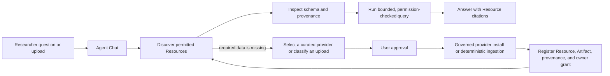

# ShennongDB Product Core

ShennongDB is governed biomedical data infrastructure with an agent-first
workspace. The product should help a researcher move from a question or a data
file to a reproducible, permission-checked answer without exposing storage or
database internals.

## Product target capabilities

The items in this section define the product direction. They are not all
implemented by the current Agent runtime; the exact shipped boundary is listed
under **Current Agent boundary** below.

1. **Identity and access**
   - First-run administrator setup, ordinary user registration, sign-in, 2FA,
     sessions, API tokens, roles, grants, and immediate user disablement.
2. **Governed Resources**
   - Discover datasets, reference genomes, annotations, expression matrices,
     wet-lab tables, Artifacts, provenance, revisions, Relations, and access
     policy through one Resource model.
3. **Upload and ingestion**
   - Stream large files, verify checksums, identify their format and, through
     deterministic format-specific jobs, eventually propose a normalization
     and registration plan before publishing governed data products.
4. **Agent-assisted research**
   - Chat with a user-selected OpenAI-compatible or local model. The Agent can
     discover Resources, inspect schemas and provenance, resolve genes, run
     bounded queries, eventually search the Research Graph, and cite the data
     it used.
5. **Projects and evidence**
   - Group Resources, observations, activities, associations, evidence, and
     context packs into a permission-filtered research workspace.
6. **Administration and operations**
   - Manage users, access, built-in data providers, ingestion, storage,
     monitoring, audit records, settings, and backups.

## Core user interfaces

These seven surfaces are the minimal product information architecture. The
Agent-specific actions shown in them remain subject to the shipped boundary
below.

1. **Agent Chat** is the default screen. It contains conversation history,
   model selection, attachments, tool progress, citations, and explicit
   approval for any data-changing action.
2. **Search** is a centered command dialog opened from the sidebar or with
   `Cmd/Ctrl+K`. It searches the current user's chats, Resources, and Projects.
3. **Resources** replaces Catalog as the canonical data browser. It retains
   filters, Resource details, provenance, schemas, Relations, access, and live
   query entry points.
4. **Projects** contains project workspaces, observations, evidence, Graph
   exploration, and Context Packs.
5. **My Data** combines uploads, ingestion status, owned Resources,
   collections, and favorites. A file can enter from this screen or directly
   from Chat, but both use the same governed ingestion pipeline.
6. **Settings** contains General, Models, Agent & Data, Security, API Tokens,
   and Account. Model credentials are per-user secrets and are never deployment
   environment variables.
7. **Admin** contains Overview, User Management, Access, Data Operations, and
   System. User Management is a first-class destination, not a hidden utility.

## Agent data flow

The model may propose a write, but it never receives direct SQL, shell, file
system, or object-storage access. Cloud models receive private or wet-lab data
only when the user and instance policy explicitly allow that data boundary.

## Current Agent boundary

The Agent-first WebUI implements a metadata-and-raw-registration MVP:

- permission-checked Resource discovery, inspection, gene resolution, and
  bounded queries with Resource citations;
- deterministic filename/content-type profiles for common 10x/HDF5, H5AD,
  Matrix Market, tabular wet-lab, FASTA, GTF/GFF, VCF, FASTQ, archive, and
  generic inputs;
- explicit per-message approval before attached uploads can be registered as a
  private raw Resource, with checksum, provenance, and an owner grant;
- discovery of built-in governed data providers and administrator-approved
  background installation when required data is missing.

The current Agent does not read arbitrary uploaded file contents, normalize
scientific data, search the Research Graph from chat, or download from arbitrary
model-supplied URLs. Raw registration is not normalization or scientific
validation. Model-generated shell commands and unapproved private-data egress
are not supported. Format-specific scientific normalizers and trusted download
connectors must be added as deterministic, tested jobs before the Agent can
claim those outcomes.

## Deployment contract

The default deployment is one image, one service, one persistent `/data`
mount, and one public port. Runtime secrets are generated on first start and
persisted under `/data/.shennong-secrets`. Administrators should only need to
choose the image, host data path, bind address, port, and an optional outbound
proxy. Advanced limits remain supported as server defaults or opt-in overrides,
but they are not part of the normal setup path.
